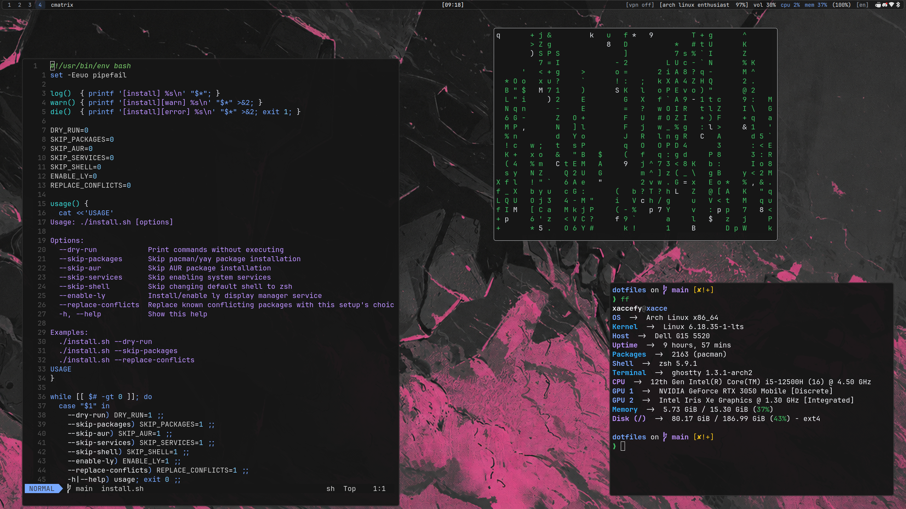

# Dotfiles



Personal Hyprland setup for Arch Linux.

## Install (quick)

```bash
# clone anywhere
git clone https://github.com/x4cc3/dotfiles-for-my-arch-linux-.git
cd dotfiles-for-my-arch-linux-
chmod +x install.sh
./install.sh
```

Run as a normal user (with `sudo`), never as root.

### Useful options

```bash
./install.sh --dry-run            # preview actions
./install.sh --skip-packages      # config only
./install.sh --skip-aur           # skip AUR packages
./install.sh --skip-services      # skip service enablement
./install.sh --skip-shell         # skip default shell change
./install.sh --enable-ly          # enable ly display manager
./install.sh --replace-conflicts  # replace known conflicting packages when needed
```

## What gets installed

- Hyprland + core tools (`hypr`, `hyprfloat`, `waybar`, `rofi`, `dunst`, `wlogout`, `swappy`)
- Terminal/shell setup (`ghostty`, `zsh`, `starship`, prompt env)
- Appearance (`gtk-3.0`, `gtk-4.0`, `fastfetch`, `wallpapers`)
- Utility scripts
- Optional AUR tools (`yay` helper, `zen-browser-bin`, `webcord`, `caffeine-ng`, `wlogout`, `awww`)

## Install behavior

- Installs official packages with `pacman -Syu --needed` and AUR packages with `yay`
- Links config folders into `~/.config`
- Links shell files to `~/.zshrc` and `~/.zshenv`
- Deploys GTK3 config as files (with home-specific bookmark paths)
- Copies default wallpaper to `~/Pictures/default.png` if missing
- Sets a portable default monitor rule; edit `hypr/lua/monitor.lua` for fixed layouts
- Optionally enables `NetworkManager`, `bluetooth`, and (optionally) `ly`
- Sets `zsh` as default shell unless `--skip-shell`

## Verify

```bash
readlink -f ~/.config/hypr
ls -la ~/.config/hypr
hyprctl version
```

If `~/.config/hypr` is not a symlink to the repo path, rerun `./install.sh`.

## Manual restore (optional)

```bash
cd dotfiles-for-my-arch-linux-
./install.sh --skip-packages
```

Or manually link a few key directories:

```bash
ln -sfn "$PWD/hypr" "$HOME/.config/hypr"
ln -sfn "$PWD/waybar" "$HOME/.config/waybar"
ln -sfn "$PWD/rofi" "$HOME/.config/rofi"
ln -sfn "$PWD/zsh/.zshrc" "$HOME/.zshrc"
ln -sfn "$PWD/zsh/.zshenv" "$HOME/.zshenv"
```

## Restore path (if needed)

Any previous config directories are backed up under:

```bash
~/.config/dotfiles-backups/<timestamp>/
```
